# TwinCAT/BSD on VMware ESXi

## Overview
This document explains how to create a virtual machine running on a [VMware ESXi Hypervisor](https://www.vmware.com/nl/products/ESXi-and-esx.html) containing [Beckhoff TwinCAT/BSD](https://www.beckhoff.com/en-en/products/ipc/software-and-tools/twincat-bsd/). 

It is assumed the reader has basic knowledge of both TwinCAT and VMware ESXi, and knows how to [access the VMware ESXi shell](https://docs.vmware.com/en/VMware-vSphere/6.7/com.vmware.vsphere.security.doc/GUID-DFA67697-232E-4F7D-860F-96C0819570A8.html) using SSH.

For testing, it is useful to have [TwinCAT 3 XAE](https://www.beckhoff.com/en-en/products/automation/twincat/te1xxx-twincat-3-engineering/te1000.html) (the Visual Studio programming environment) at hand on your system. It is not required for the installation itself.

Tested with:
- TwinCAT/BSD version 13.0.11.3, build 55702
- TwinCAT 3 XAE v3.1.4024.29
- VMware ESXi 6.7

## Instructions

### 1. Convert the TwinCAT/BSD installer disc image

1. [Download](https://www.beckhoff.com/en-en/support/download-finder/software-and-tools/) and unzip the TwinCAT/BSD ISO file, e.g., `TCBSD-x64-13-55702.iso`
1. VMware will not recognize this ISO file as bootable media. Therefore, we have to convert the ISO to a bootable VMware disk image using VirtualBox. [Download](https://www.virtualbox.org/wiki/Downloads) and install VirtualBox (tested with 6.1.38).
1. Convert the ISO to a VMware VMDK disk image (replace paths where needed):
	```
	D:\Downloads>"C:\Program Files\Oracle\VirtualBox\VBoxManage.exe" convertfromraw --format VMDK TCBSD-x64-13-55702.iso TCBSD.vmdk
	Converting from raw image file="TCBSD-x64-13-55702.iso" to file="TCBSD.vmdk"...
	Creating dynamic image with size 643713536 bytes (614MB)...
	```
	When the conversion has finished, VirtualBox is no longer needed and can be uninstalled.

1. The resulting file can be used by VMware Workstation, but not by ESXi. Therefore, we have to convert it to a ESXi compatible disk image.\
Upload `TCBSD.vmdk` to the ESXi datastore.
1. Open up a ESXi SSH shell terminal, and convert the image using `vmkfstools` (replace paths where needed):
	```
	[root@192:~] vmkfstools -i /vmfs/volumes/datastore1/TCBSD.vmdk /vmfs/volumes/datastore1/TCBSD_installer.vmdk
	Destination disk format: VMFS zeroedthick
	Cloning disk '/vmfs/volumes/datastore1/TCBSD.vmdk'...
	Clone: 100% done.
	```
	This creates 2 new files: `TCBSD_installer.vmdk` and `TCBSD_installer-flat.vmdk`.

### 2. Create the Virtual Machine

1. Create a new ESXi VM. For the OS, select "Other" and "FreeBSD 12 or later versions (64-bit)"
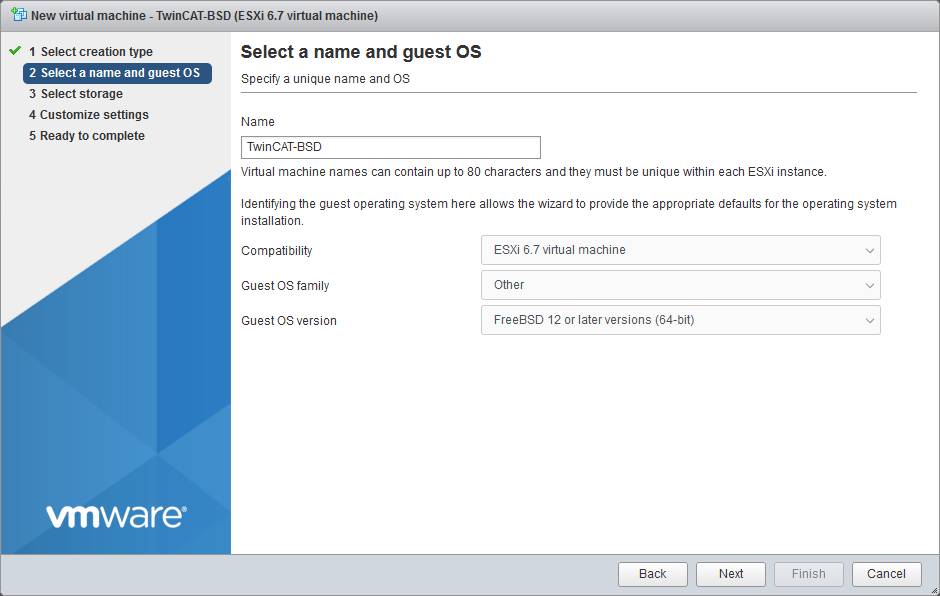
1. Add an existing harddrive. When prompted, select  `TCBSD_installer.vmdk`\
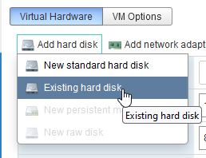\
The end result should look something like this:

1. In the boot options, select EFI as the firmware. Otherwise the installer will not boot!
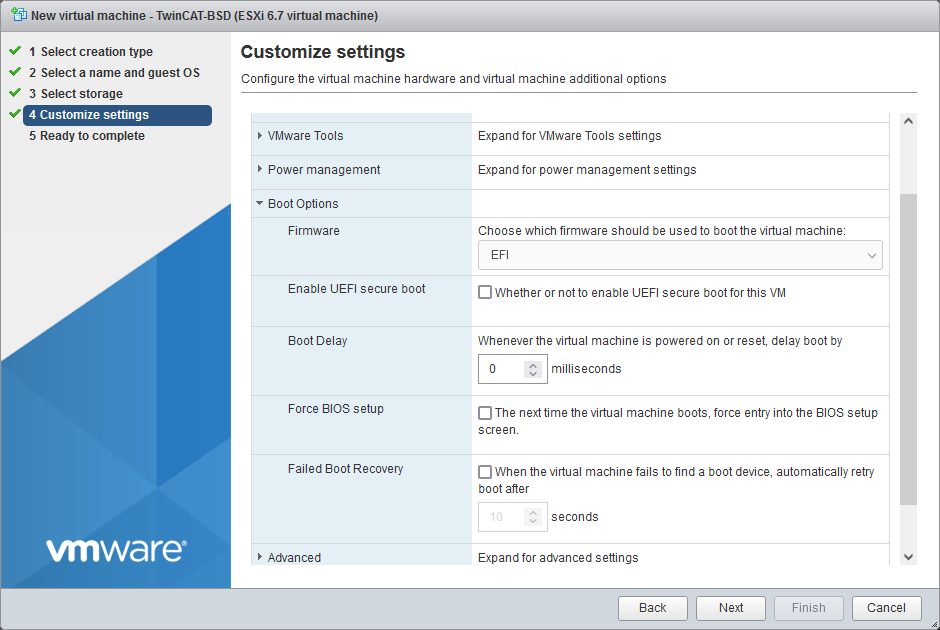
1. Finish the VM, and start it. 

### 3. Install TwinCAT/BSD

1. After a while, the Beckhoff TC/BSD Installer welcome screen should appear.\
**TIP** Write down the IP address shown in the welcome screen.\
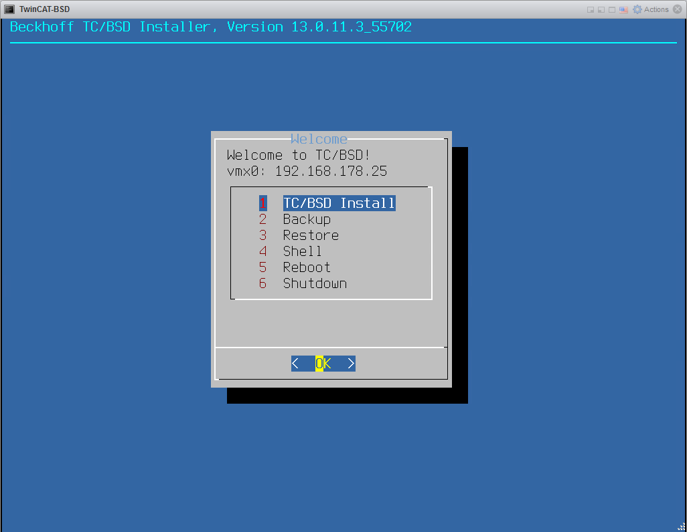
1. Select `TC/BSD Install`, and select the first disk.
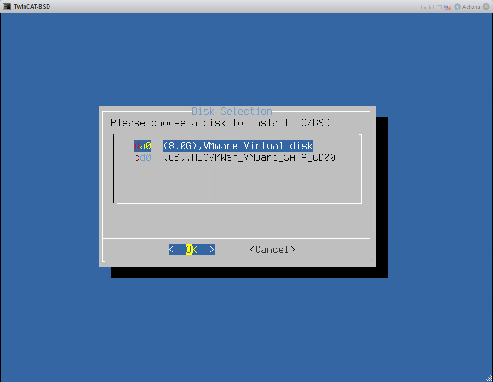
1. Enter an administrator password in the next screen, and wait for the installation to finish.
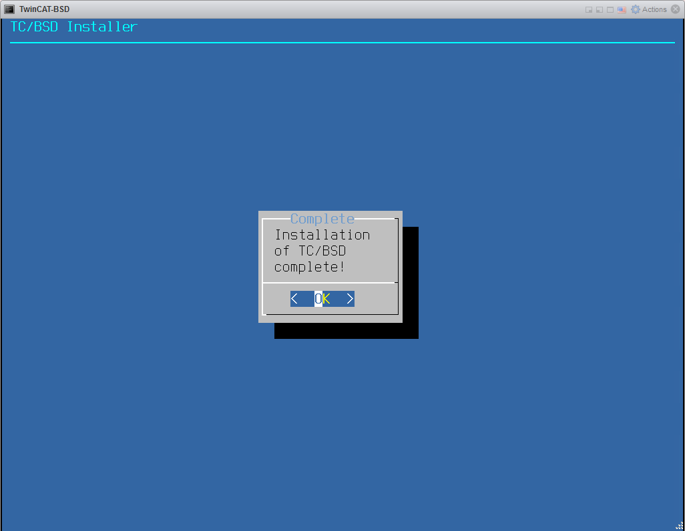
Press Enter to return to the main menu, and select `Shutdown`. Wait for the system to power off.
1. Open the VM options, and remove the TC/BSD installer hard disk. The files can be deleted safely.
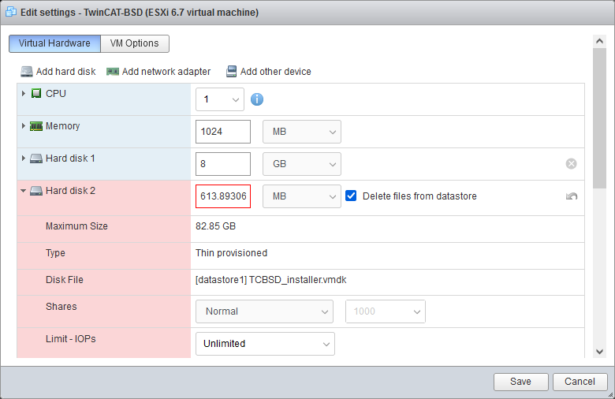
1. Power on the VM. After a while, the TC/BSD login screen appears. You have now successfully installed TC/BSD!

### 4. Testing the system

It is now time to see if we can connect to the TwinCAT/BSD VM.

1. Open the Edit Routes windows from the Windows taskbar:\
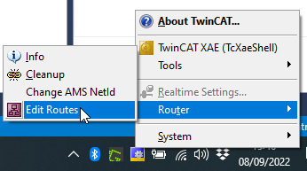
1. Click **Add** to open the Add Route Dialog. Click **Broadcast Search**. Assuming the VM has an IP in the same range as your PC, the VM should be detected:
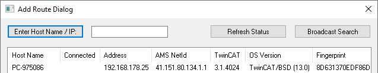
1. Select the VM, check **Advanced Settings**, make sure the **IP Address** radio button is selected (we have experienced connection issues when using the Host Name).\
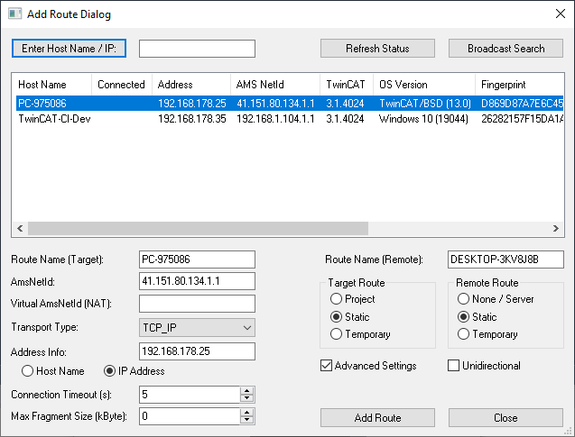\
1. Click **Add Route**, check **Secure ADS** and enter the administrator password. Click OK to add the route.\
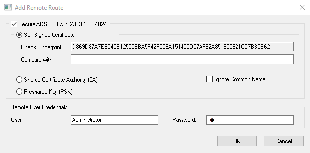\
**TIP** If you want to use the simple insecure login (unencrypted ADS communication), be sure to add the corresponding firewall rule on the VM. Instructions can be found in the [Beckhoff TwinCAT/BSD manual](http://ftp.beckhoff.com/download/document/ipc/embedded-pc/embedded-pc-cx/TwinCAT_BSD_en.pdf), chapter 4.3.
1. If the route has been added succesfully, a lock icon appears in the Connected column:
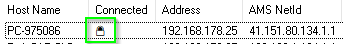\
Click OK, and OK again in the **Choose Target System** windows (which now shows the VM)\
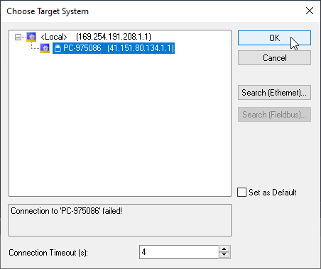\
You have now successfully created a route to the VM, and it is ready for use!

## Next steps

This is a good time to make a snapshot of the VM. Open up a terminal to the VM's IP and login with name `Administrator` and the password provided earlier. Enter `doas shutdown -p now` to shutdown the VM. Take a snapshot with ESXi.

Check out the [Beckhoff TwinCAT/BSD manual](http://ftp.beckhoff.com/download/document/ipc/embedded-pc/embedded-pc-cx/TwinCAT_BSD_en.pdf) for useful tips on setting up the system and upgrading to newer versions.

Want real-time performance? then check out [this article by VMware](https://www.vmware.com/techpapers/2013/deploying-extremely-latency-sensitive-applications-10383.html), explaining how to minimize latency (jitter) by exclusively assigning physical CPU cores to a VM.

## Feedback

Suggestions and feedback are always welcome! preferably by creating an issue or a pull request.

## Credits

Thanks to [r9guy](https://github.com/r9guy) for providing [instructions](https://github.com/r9guy/TwinCAT-BSD-VM-creator) on how to convert the ISO using VirtualBox.

Detailed [installation instructions](https://cookncode.com/twincat/2022/08/11/twincat-bsd.html) for VirtualBox and VMware Workstation can be found on [Roald87's](https://github.com/roald87) website [Cook & Code](https://cookncode.com/). Be sure to check out his repos and website for more TwinCAT tips & tricks!

And a must-read is [Jakob Sagatowski's](https://github.com/sagatowski) excellent blog [AllTwinCAT](https://alltwincat.com/), its packed with useful information.
